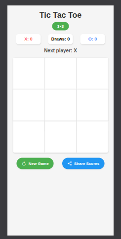
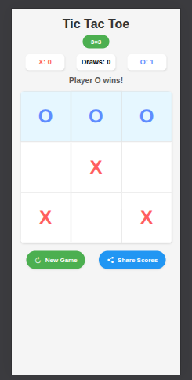

# Tic Tac Toe Game - React Native with Expo

  
## 📱 Overview

A fully-featured Tic Tac Toe game built with React Native and Expo, featuring:
- Classic 3×3 and challenging 4×4 game modes
- Smooth animations and visual feedback
- Score tracking and game history
- Shareable game results
- Responsive design for all screen sizes

## ✨ Features

- **Two Game Modes**: Switch between 3×3 (classic) and 4×4 (requires 4 in a row)
- **Visual Animations**: Cell presses, win celebrations, and smooth transitions
- **Score Tracking**: Keeps count of X wins, O wins, and draws
- **Game History**: View your last 5 games with results and timestamps
- **Share Results**: Easily share your scores with friends
- **Responsive Design**: Works on phones and tablets of all sizes

## 🛠️ Technical Details

- **Built with**: React Native + TypeScript
- **Animation**: React Native Animated API
- **Icons**: Expo Vector Icons
- **Sharing**: React Native Share API
- **State Management**: React Hooks

## 🚀 Getting Started

### Prerequisites

- Node.js (v14+ recommended)
- Expo CLI (`npm install -g expo-cli`)
- Yarn or npm

### Installation

1. Clone the repository:
   ```bash
   git clone https://github.com/your-repo/tic-tac-toe.git
   cd tic-tac-toe
   ```

2. Install dependencies:
   ```bash
   npm install
   # or
   yarn install
   ```

3. Start the development server:
   ```bash
   expo start
   ```

4. Run on your device/emulator:
   - Scan the QR code with the Expo Go app (Android/iOS)
   - Or press `i` for iOS simulator / `a` for Android emulator

## 📂 Project Structure

```
tic-tac-toe/
├── App.tsx            # Main application entry point
├── components/        # Game components
│   └── TicTacToe.tsx  # Main game component
├── assets/            # Static assets
├── types/             # TypeScript type definitions
└── styles/            # Style sheets
```

## 🎨 Customization

You can easily customize:
- Colors in the `styles` object
- Animation durations and effects
- Board size and win conditions
- Number of historical games saved

## 🤝 Contributing

Contributions are welcome! Please open an issue or submit a pull request.

## 📄 License

This project is licensed under the MIT License.
